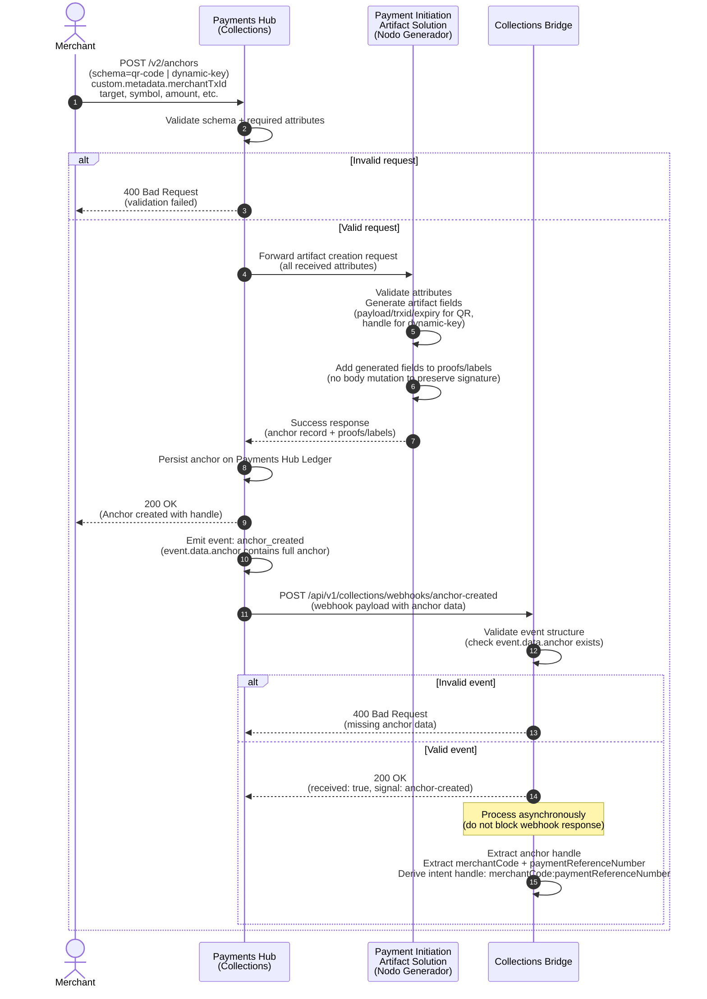

# Flow 1 — Payment Initiation Artifact Generation

This diagram shows how a merchant creates a payment initiation artifact (QR code or dynamic key) through the Payments Hub, and how the Collections Bridge receives the anchor creation event.

## Key Points

- **Merchant** sends anchor creation request to Payments Hub with schema (`qr-code` or `dynamic-key`), `merchantTxId`, and payment details
- **Payments Hub** validates and forwards to **Artifact Solution** (Nodo Generador)
- **Artifact Solution** generates artifact-specific fields (QR payload/trxid/expiry or dynamic-key handle) and adds them via proofs/labels without mutating the original body
- **Payments Hub** persists the anchor and emits `anchor_created` event
- **Collections Bridge** receives webhook, validates, responds immediately (200 OK), then processes asynchronously
- Intent handle is derived as `merchantCode:paymentReferenceNumber` from the anchor data
