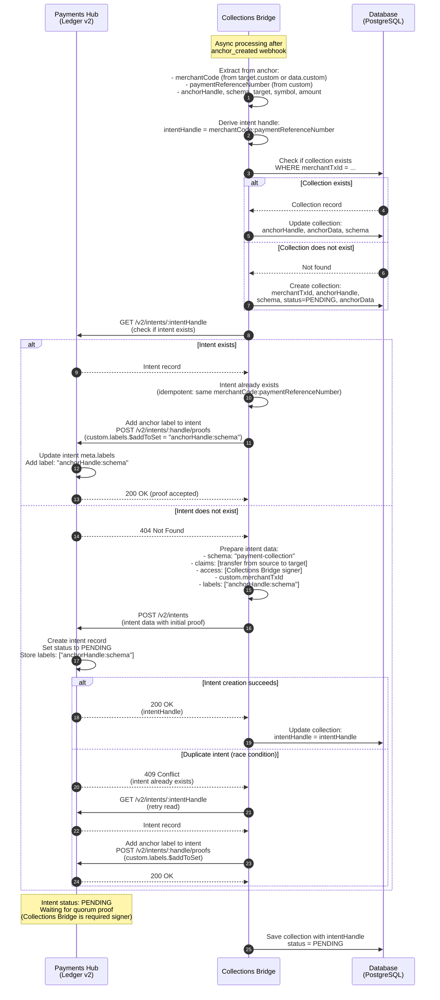

# Flow 2 — Intent Generation (Idempotent)

This diagram shows how the Collections Bridge processes the `anchor_created` event to create or update an intent on the Payments Hub Ledger. The intent handle format is `merchantCode:paymentReferenceNumber`, making it idempotent.

## Key Points

- **Intent handle format**: `merchantCode:paymentReferenceNumber` ensures idempotency
- **Collection tracking**: Collections Bridge maintains a database record for each collection (by `merchantTxId`)
- **Intent creation**: If intent doesn't exist, create with:
  - Schema: `payment-collection`
  - Claim: transfer from `INTENT_CLAIM_SOURCE_HANDLE` (config) to anchor target
  - Access: Collections Bridge signer public key
  - Labels: `["anchorHandle:schema"]` (e.g., `["QR-xxx:qr-code"]`)
  - Custom: `merchantTxId` for indexing
- **Idempotency**: If intent already exists (same handle), add anchor label instead of creating duplicate
- **Race condition handling**: If POST returns 409 Conflict, read existing intent and add label
- **Intent status**: Created as `PENDING`, waiting for Collections Bridge to submit committed proof (Flow 3)
