# Flow 3 — Intent Fulfillment (RTP Webhook → Proof → Completion)

This diagram shows how the Collections Bridge processes RTP fulfillment webhooks, finds the corresponding intent, submits a committed proof to complete the quorum, and updates anchor statuses.

```mermaid
sequenceDiagram
    autonumber
    participant RTP as RTP Network<br/>Participant MDW
    participant CB as Collections Bridge
    participant H as Payments Hub<br/>(Ledger v2)

    RTP->>CB: POST /api/v1/collections/webhooks/rtp-fulfillment<br/>(intent-updated event with status=committed)

    CB->>CB: Validate webhook payload<br/>Extract intent data and status

    alt Status is not "committed"
        CB->>CB: Skip processing<br/>(log and return)
        CB-->>RTP: 200 OK<br/>(event accepted, skipped)
    else Status is "committed"
        CB-->>RTP: 200 OK<br/>(event accepted, processing async)

        Note over CB: Process asynchronously<br/>(do not block webhook response)

        CB->>CB: Extract from claim[0].target:<br/>- idQR (normalized: trim quotes/whitespace)<br/>- aliasValue (normalized)

        CB->>H: Search anchor by idQR<br/>GET /v2/anchors?data.custom.paymentId=idQR<br/>(x-schema: qr-code)

        alt Anchor found by idQR
            H-->>CB: Anchor record (QR code)
        else Anchor not found by idQR
            alt aliasValue provided
                CB->>H: Read anchor by handle<br/>GET /v2/anchors/:aliasValue<br/>(treat aliasValue as anchor handle for dynamic-key)
                
                alt Anchor found by aliasValue
                    H-->>CB: Anchor record (dynamic-key)
                else Anchor not found by aliasValue
                    H-->>CB: 404 Not Found
                    CB->>CB: Log error and skip<br/>No anchor found for idQR or aliasValue<br/>Cannot process fulfillment
                end
            else No aliasValue provided
                CB->>CB: Log error and skip<br/>No anchor found for idQR<br/>and no aliasValue provided<br/>Cannot process fulfillment
            end
        end

        alt Anchor found
            CB->>CB: Extract from anchor:<br/>- merchantCode (from target.custom or data.custom)<br/>- paymentReferenceNumber (from custom)

            alt Anchor missing merchantCode or paymentReferenceNumber
                CB->>CB: Log error and skip<br/>Cannot derive intent handle
            else Anchor has required fields
                CB->>CB: Derive intent handle:<br/>intentHandle = merchantCode:paymentReferenceNumber

                CB->>H: GET /v2/intents/:intentHandle<br/>(read intent on Payments Hub Ledger)

                alt Intent not found
                    CB->>CB: Log error and skip<br/>Intent does not exist
                else Intent found
                    H-->>CB: Intent record

                    CB->>CB: Check if intent already has<br/>our committed proof (idempotency check)

                    alt Already has our committed proof
                        CB->>CB: Skip proof submission<br/>(idempotent: already processed)
                    else Does not have our proof
                        CB->>CB: Prepare proof detail:<br/>{ rtpIntentHandle, rtpStatus,<br/>fulfilledAt, anchorHandle, coreId }

                        CB->>H: POST /v2/intents/:intentHandle/proofs<br/>(status: committed, detail, bridge signature)

                        H-->>CB: 200 OK<br/>(proof accepted immediately)

                        Note over H: Process asynchronously:<br/>Verify proof signature<br/>Check quorum rules<br/>If quorum met: transition to COMPLETED<br/>Store proof in meta.proofs
                    end

                    Note over CB: Update anchor statuses<br/>(serialized by intent handle for race safety)

                    CB->>H: GET /v2/intents/:intentHandle<br/>(read intent to get all anchor labels)

                    H-->>CB: Intent with meta.labels:<br/>["anchorHandle1:schema1", "anchorHandle2:schema2", ...]

                    CB->>CB: Extract anchor handles from labels<br/>For each anchor handle:

                    loop For each anchor in intent labels
                        alt Anchor is the completing one
                            CB->>CB: Check if anchor already has<br/>COMPLETED proof (idempotency)
                            
                            alt Already has COMPLETED proof
                                CB->>CB: Skip (idempotent)
                            else Does not have COMPLETED proof
                                CB->>H: POST /v2/anchors/:anchorHandle/proofs<br/>(status: COMPLETED, reason: "completed",<br/>paymentReference: intentHandle)
                                H->>H: Add proof to anchor meta.proofs
                                H-->>CB: 200 OK
                            end
                        else Anchor is not the completing one
                            CB->>CB: Check if anchor already has<br/>CANCELLED proof (idempotency)
                            
                            alt Already has CANCELLED proof
                                CB->>CB: Skip (idempotent)
                            else Does not have CANCELLED proof
                                CB->>H: POST /v2/anchors/:anchorHandle/proofs<br/>(status: CANCELLED,<br/>reason: "completed by anchorHandle",<br/>paymentReference: intentHandle)
                                H->>H: Add proof to anchor meta.proofs
                                H-->>CB: 200 OK
                            end
                        end
                    end
                end
            end
        else Anchor not found
            CB->>CB: Log error and skip<br/>No anchor found<br/>Cannot process fulfillment
        end
    end
```

## Key Points

- **Webhook processing**: RTP sends `intent-updated` event with `status=committed`; Collections Bridge responds immediately (200 OK) and processes asynchronously
- **Anchor lookup**: 
  - First tries to find by `idQR` (paymentId) with `x-schema: qr-code` header
  - Falls back to reading anchor by handle if `aliasValue` is provided (for dynamic-key)
  - Normalizes `idQR` and `aliasValue` (trims quotes/whitespace) to handle RTP data quality issues
  - **If no anchor is found**: Logs error and skips processing (nothing happens, webhook already responded 200 OK)
- **Intent lookup**: Derives intent handle as `merchantCode:paymentReferenceNumber` from anchor data
- **Proof submission**: 
  - Checks idempotency: skips if intent already has our committed proof
  - Submits proof with `status: committed`, detail (RTP references), and `coreId` (RTP intent handle)
  - Proof detail includes: `rtpIntentHandle`, `rtpStatus`, `fulfilledAt`, `anchorHandle`, `coreId`
  - **Ledger responds immediately**: Returns 200 OK right away, then processes proof verification, quorum check, and state transition asynchronously
- **Intent completion**: After proof is verified and quorum is met, Payments Hub transitions intent to `COMPLETED` asynchronously
- **Anchor status updates**: 
  - Completing anchor: `COMPLETED` proof with `reason: "completed"`, `paymentReference: intentHandle`
  - Other anchors: `CANCELLED` proof with `reason: "completed by <anchorHandle>"`, `paymentReference: intentHandle`
  - Updates are serialized by intent handle to prevent race conditions when webhook is called multiple times
  - Idempotent: checks if anchor already has the proof before submitting
